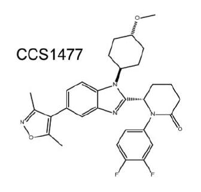
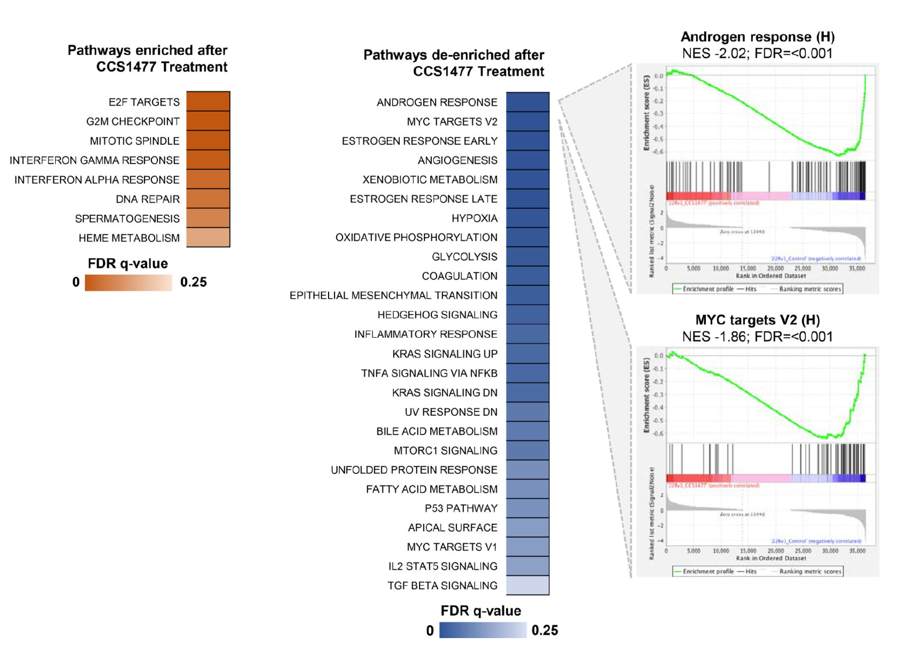
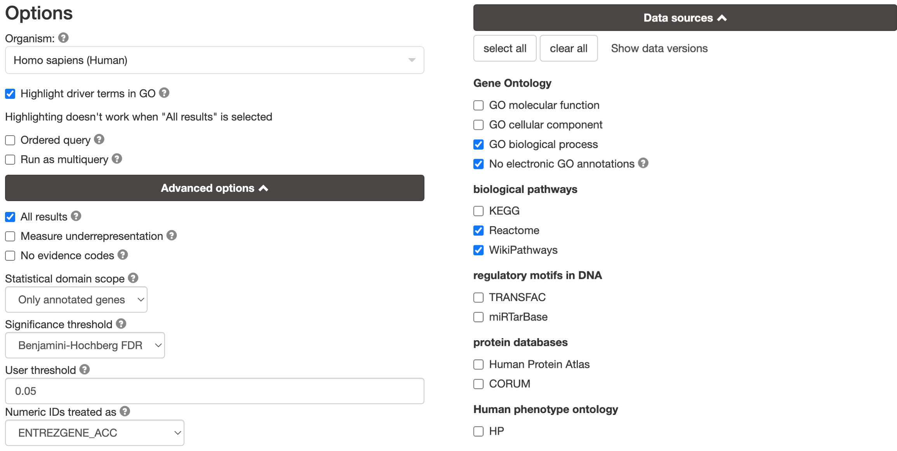
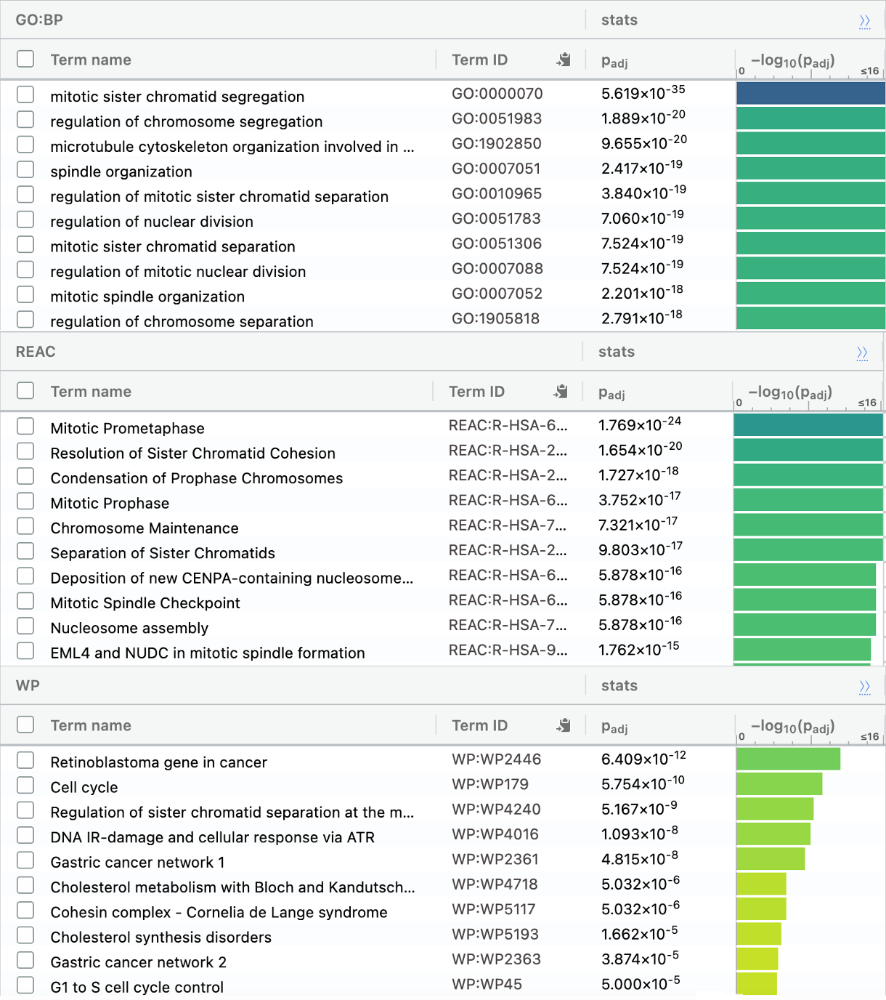
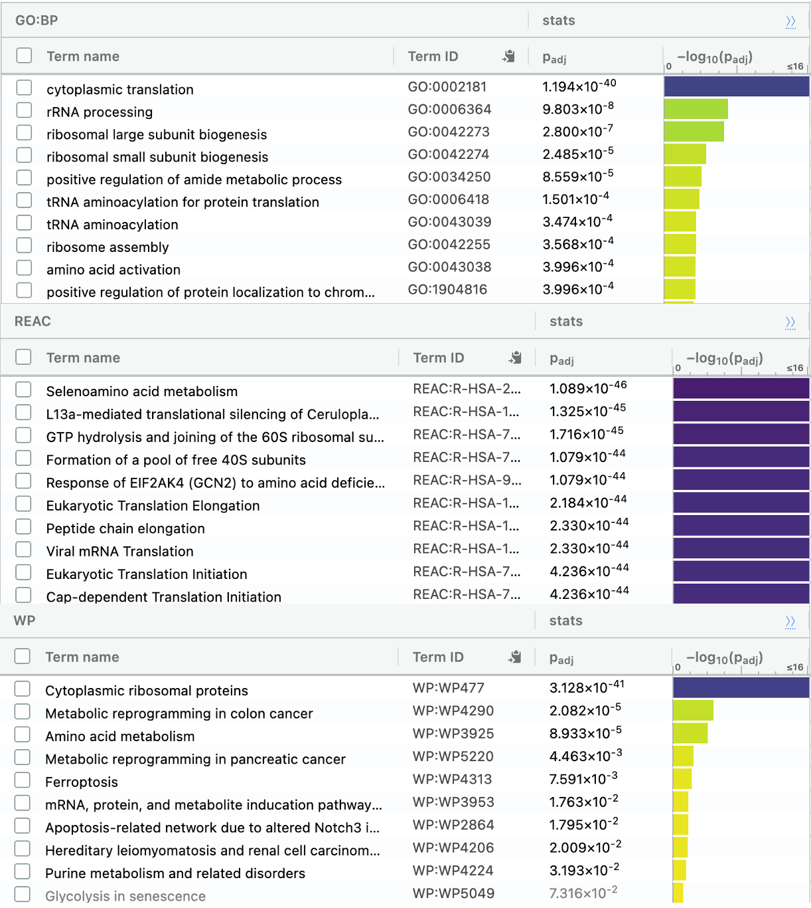

# Introduction
In the previous assignment, RNASeq data were obtained from GEO (GSE162564) based on a study on the efficacy of CCS1477 (Figure 1), a novel small-molecule inhibitor of the p300/CBP proteins involved in human prostate cancer growth (de Bono et al., 2021)[@detargeting]. To clean the RNASeq data, duplicate gene IDs were removed, low counts were filtered out, and normalization was performed using a TMM (Trimmed Mean of M-values) method. The final dataset has 14,462 rows, with HUGO symbols as rownames. There are 6 columns: 3 samples treated with CCS1477 (22Rv1-CCS1477), and 3 controls (22Rv1-Control).



In this assignment, differential gene expression analysis is performed to determine which genes are significantly upregulated or downregulated when treated with CCS1477. Using the list of upregulated and downregulated genes, thresholded over-representation analysis is performed using g:Profiler to associate the genes with GO terms, to determine the pathways that are differentially expressed. In the original study, genes related to cell cycle and DNA-repair pathways were upregulated, while androgen response and MYC target pathways were downregulated (Figure 2). The results we obtain using g:Profiler should, in theory, be similar. 



# Procedures & Results

## Differential Gene Expression

First, load the data from the previous assignment:
```{r message = FALSE, warning = FALSE}
# load the data from A1:
normalized_count_data <- read.table(file=file.path(getwd(), 
                "a1_normalized_counts.txt"),
                                    header = TRUE,sep = "\t",
                                    stringsAsFactors = FALSE,
                                    check.names=FALSE)

dim(normalized_count_data)
knitr::kable(normalized_count_data[1:5,1:5], type="html")
```

```{r}
# convert to a matrix
filtered_data_matrix_a2 <- as.matrix(normalized_count_data)
filtered_data_matrix_a2[1:5, 1:6]
```
To create a DGE list, we use the "groups" defined in the previous assignment:
```{r}
samples <- read.csv(file=file.path(getwd(), 
                "a1_samples"),
                                    header = TRUE,
                                    stringsAsFactors = FALSE,
                                    check.names=FALSE)
samples
```
```{r}
# create a DGE list
library(edgeR)

d = DGEList(counts=filtered_data_matrix_a2, group=samples$cell_type)

# create the model
model_design_pat <- model.matrix(
  ~ samples$replicate + samples$cell_type)
```

```{r message = FALSE, warning = FALSE}
#estimate dispersion
d <- estimateDisp(d, model_design_pat)
#calculate normalization factors
d <- calcNormFactors(d)
```

### MDS plot
```{r message = FALSE, warning = FALSE}
# draw MDS plot
limma::plotMDS(d, labels=samples[,1],
col = c("darkgreen","blue")[factor(samples$cell_type)], main = "MDS plot")
```

From the MDS plot, a clear separation between the treatment and control is observed.

Patient variability does not seem to be a strong factor.

### gene expression analysis using edgeR::glmQLFTest

Finally, perform a differential gene expression analysis using edgeR::glmQLFTest
```{r}
#fit model
fit <- glmQLFit(d, model_design_pat)
#calculate differential expression
qlf.pos_vs_neg <- glmQLFTest(fit, coef='samples$cell_typeControl')
qlf_output_hits <- topTags(qlf.pos_vs_neg,sort.by = "PValue",
                           n = nrow(filtered_data_matrix_a2))
```

Check the number of genes with PValue < 0.05 and FDR < 0.05
```{r}
# How many gene pass the threshold p-value < 0.05?
length(which(qlf_output_hits$table$PValue < 0.05))

# How many genes pass correction?
length(which(qlf_output_hits$table$FDR < 0.05))
```

```{r}
knitr::kable(topTags(qlf.pos_vs_neg), type="html", digits = 32)
```

### MA plot
```{r}
logFC <- qlf_output_hits$table$logFC
logCPM <- qlf_output_hits$table$logCPM

plot(logCPM, logFC, xlab="log CPM", ylab="log-fold-change", pch=16, cex=0.4, main = "MA plot: CCS1477 vs. control")


```

Over a few dozen genes have more than two-fold upregulation.
With 1,212 genes having FDR < 0.05, we have enough genes to work with.

glmQLFTest uses BH as the default correction method. Since BH is suitable for dealing with a large number of hypotheses and for controlling FDR, it is also appropriate for our dataset.


### Heatmap 

Next, we visualize the data using a heatmap.
```{r message = FALSE, warning = FALSE}
if (!require("BiocManager", quietly = TRUE))
    install.packages("BiocManager")
BiocManager::install("ComplexHeatmap")

library(ComplexHeatmap)
library(circlize)

# first, create a numerical matrix of top hits
tophits <- qlf_output_hits$table[which(qlf_output_hits$table$FDR < 0.05),]

heatmap_matrix <- normalized_count_data
heatmap_matrix_tophits <- t(
  scale(t(heatmap_matrix[
    which(rownames(heatmap_matrix) %in% rownames(tophits)),])))

if(min(heatmap_matrix_tophits) == 0){
    heatmap_col = colorRamp2(c( 0, max(heatmap_matrix_tophits)), 
                             c( "white", "red"))
  } else {
    heatmap_col = colorRamp2(c(min(heatmap_matrix_tophits), 0,
      max(heatmap_matrix_tophits)), c("blue", "white", "red"))
  }
current_heatmap <- Heatmap(as.matrix(heatmap_matrix_tophits),
                           cluster_rows = TRUE,
                           cluster_columns = TRUE,
                               show_row_dend = TRUE,
                               show_column_dend = TRUE, 
                               col=heatmap_col,
                               show_column_names = TRUE, 
                               show_row_names = FALSE,
                               show_heatmap_legend = TRUE,
                               )
current_heatmap
```

The conditions seem to cluster together very well. There is a clear distinction between the expression patterns in treatment and control samples.


## Thresholded over-representation analysis
From the top-hits obtained above, we will make a thresholded list with PValue < 0.001 to work with a smaller set of genes. Compared to a ranked-list method, the thresholded list method provides readily accessible tools for gene list enrichment analysis, such as g:Profiler (Raudvere et al., 2019)[@gProfiler] that can produce the results quickly.

```{r}
# get upregulated & downregulated genes
# use a strict threshold 0.001 to get a few hundred genes

upregulated_genes <- rownames(qlf_output_hits)[
  which(qlf_output_hits$table$PValue < 0.001 
             & qlf_output_hits$table$logFC > 0)]
downregulated_genes <- rownames(qlf_output_hits)[
  which(qlf_output_hits$table$PValue < 0.001 
             & qlf_output_hits$table$logFC < 0)]
length(upregulated_genes)
length(downregulated_genes)

# output into files
write.table(x=upregulated_genes,
            file=file.path("a2_upregulated_genes.txt"),sep = "\t",
            row.names = FALSE,col.names = FALSE,quote = FALSE)
write.table(x=downregulated_genes,
            file=file.path("a2_downregulated_genes.txt"),sep = "\t",
            row.names = FALSE,col.names = FALSE,quote = FALSE)
```

### g:Profiler

The list of these upregulated and downregulated genes were fed to g:Profiler with custom options (Figure 3) to obtain a list of GO terms. With duplicate terms, the EnsemblID with the most GO annotations was selected. The term size range was adjusted to 5 to 200. 




### Upregulated genes

For the upregulated genes, pathways related to translation (peptide elongation) were highly enriched (Figure 3), which is also the top item in the original study. Other terms did not seem dominant in the g:Profiler result, which could be because they used a wider range of FDR values (0 to 0.25) in the original study. 



### Downregulated genes

For the downregulated genes, pathways related to mitosis (chromosome segregation, spindle formation etc.) were highly enriched (Figure 5). This is different from what was found in the original study, where the dominant terms include a wide range of pathways such as ANDROGEN RESPONSE and MYC TARGETS V2.



### The Whole list

The whole list (including upregulated and downregulated genes) was also used to generate a list of GO terms. The terms seemed to be a mix of those seen in the two cases mentioned above. There were no significant differences revealed by combining the two lists.

### Checking the Androgen Response pathways

In order to check if the list of downregulated genes contains those related to androgen response, the "Hallmark Androgen Response" gene set was obtained from MolSigDB v7.1[@androgen].

```{r}
# "Hallmark Androgen Response" gene set

androgen = "ABCC4	ABHD2	ACSL3	ACTN1	ADAMTS1	ADRM1	AKAP12	AKT1	ALDH1A3	ANKH	APPBP2	ARID5B	AZGP1	B2M	B4GALT1	BMPR1B	CAMKK2	CCND1	CCND3	CDC14B	CDK6	CENPN	DBI	DHCR24	DNAJB9	ELK4	ELL2	ELOVL5	FADS1	FKBP5	GNAI3	GPD1L	GSR	GUCY1A1	H1-0	HERC3	HMGCR	HMGCS1	HOMER2	HPGD	HSD17B14	IDI1	INPP4B	INSIG1	IQGAP2	ITGAV	KLK2	KLK3	KRT19	KRT8	LIFR	LMAN1	MAF	MAK	MAP7	MERTK	MYL12A	NCOA4	NDRG1	NGLY1	NKX3-1	PA2G4	PDLIM5	PGM3	PIAS1	PLPP1	PMEPA1	PTK2B	PTPN21	RAB4A	RPS6KA3	RRP12	SAT1	SCD	SEC24D	SELENOP	SGK1	SLC26A2	SLC38A2	SMS	SORD	SPCS3	SPDEF	SRF	SRP19	STEAP4	STK39	TARP	TMEM50A	TMPRSS2	TNFAIP8	TPD52	TSC22D1	UAP1	UBE2I	UBE2J1	VAPA	XRCC5	XRCC6	ZBTB10	ZMIZ1"

androList <- unlist(strsplit(androgen, "\t"))

overlap <- downregulated_genes %in% androList
sum(overlap)

overlap_gene <- downregulated_genes[overlap]
overlap_gene
```

Indeed, 6 androgen response genes are in the list of downregulated genes we obtained.

Let's check the upregulated list
```{r}
overlap <- upregulated_genes %in% androList
sum(overlap)

overlap_gene <- upregulated_genes[overlap]
overlap_gene
```
The upregulated list contains 29. 
This seems to contradict the finding in the original study.

## Interpretation
The original study suggested CCS147 downregulates AR signaling, suppressing prostate cancer activity.
This happens via CCS147 inhibiting p300/CBP proteins, transcription factors that increase the expression of AR signaling genes.
KLK3 and TMPRSS2 were in the list of UPregulated genes we obtained. However, the original study included experiments using a patient-derived model of lethal prostate cancer, where these genes were DOWNregulated with CCS147 treatment.
Even when considering the possibility that the direction was flipped somewhere along this report, it is still unclear why "translation" shows up as the top GO term for the upregulated genes, which is also the case in the original study. 


# Conclusion & Outlook

The heatmap we obtained shows that some genes are significantly upregulated or downregulated as a result of CCS147 treatment. However, the list of GO terms obtained from g:Profiler did not align well with our expectations.

# Reference
