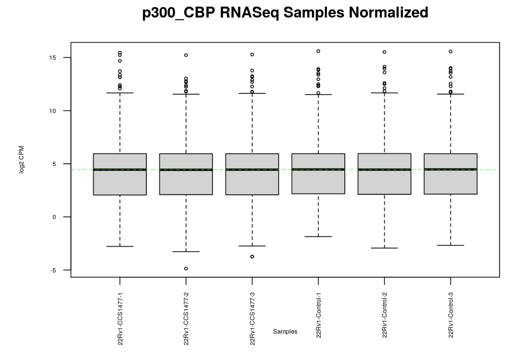
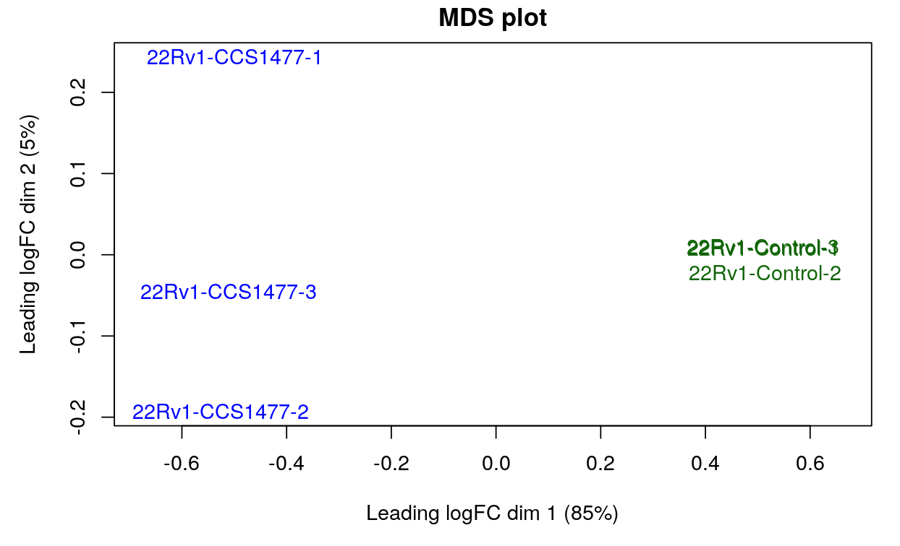
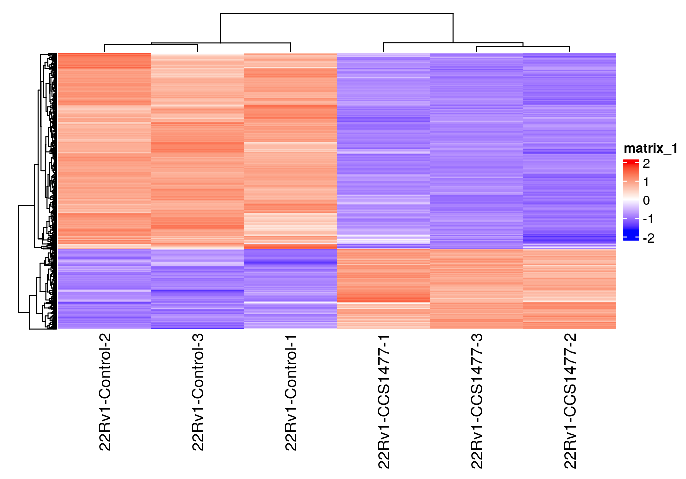
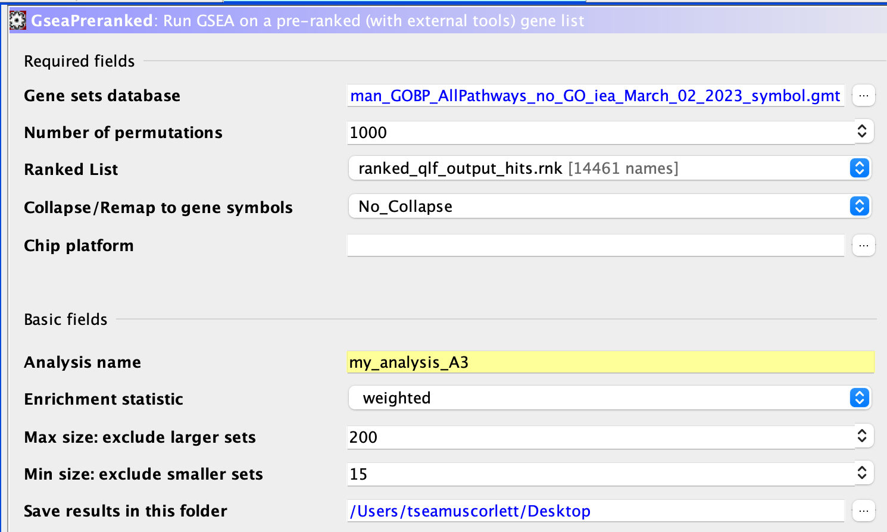
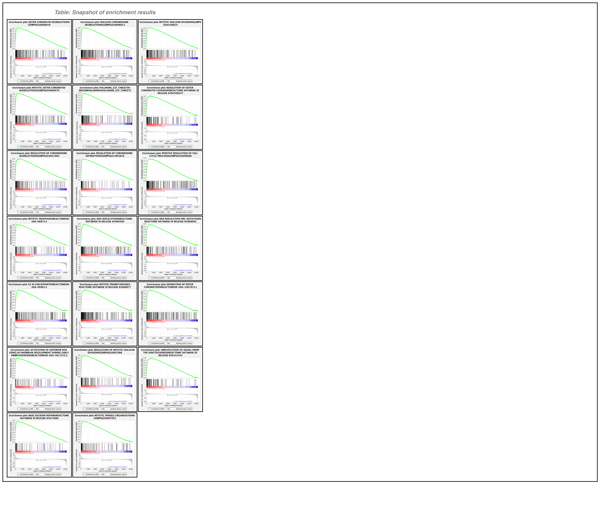
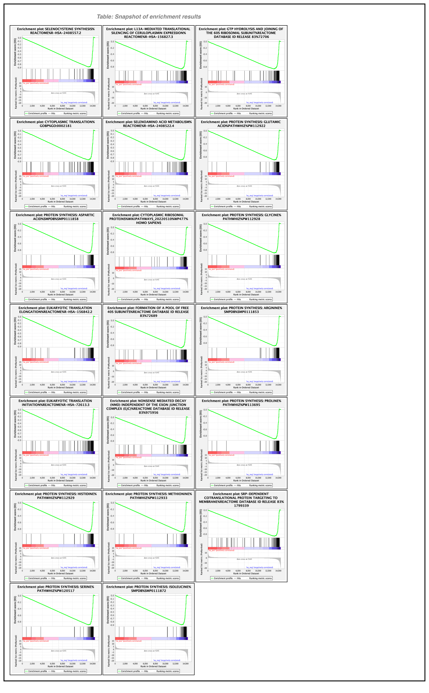
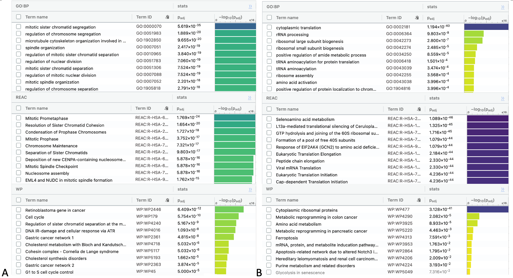
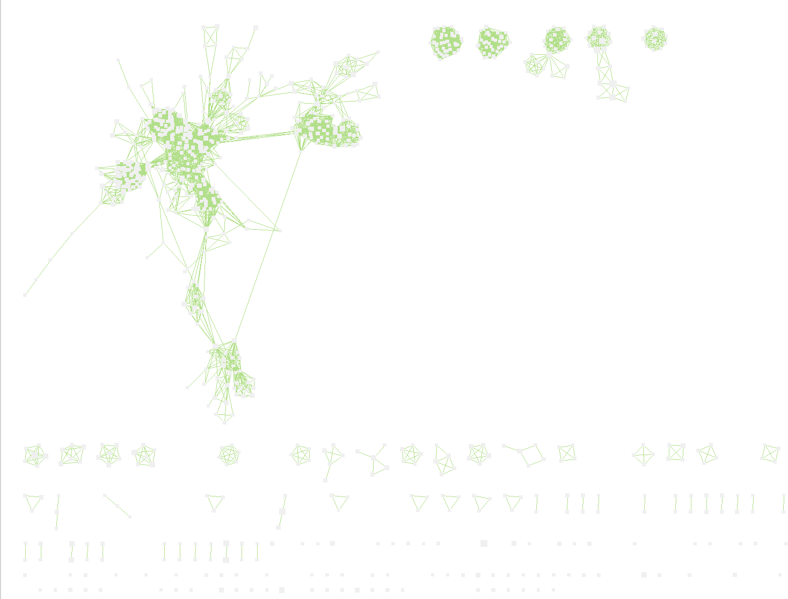

# Introduction
CCS1477 (Figure 1) is a small-molecule inhibitor of p300/CBP conserved bromodomain which could act as a therapeutic agent for treating lethal prostate cancer (de Bono et al., 2021)[@detargeting]. In the previous assignments,RNASeq data were obtained from GEO (GSE162564), duplicate gene IDs were removed, low counts were filtered out, and normalization was performed using a TMM (Trimmed Mean of M-values) method. The resulting dataset contained 14,462 rows with HUGO symbols as rownames, and 6 columns: 3 samples treated with CCS1477, and 3 controls (Figure 2, 3). Then, a heatmap was constructed based on the lists of significantly upregulated and downregulated genes as a result of CCS147 treatment in prostate cancer model cells (Figure 4, 5). Thresholded over-representation analysis was perform to obtain GO enrichment using g:Profiler (Raudvere et al., 2019)[@gProfiler]. The GO terms associated with these genes showed that androgen response is downregulated with CCS147 treatment.











In this study, we will perform a non-thresholded Gene Set Enrichment Analysis (GSEA) to compare the results with the thresholded method performed previously. 
Then we will use Cytoscape to visualize the data to get a better understanding of how these pathways are related to each other.


# Procedures & Results

## Non-thresholded Gene Set Enrichment Analysis

First, load the data from the previous assignment:
```{r message = FALSE, warning = FALSE}
# load the data from A2:
qlf_output_hits <- read.table(file=file.path(getwd(), 
                "qlf_output_hits.txt"),
                                    header = TRUE,sep = "\t",
                                    stringsAsFactors = FALSE,
                                    check.names=FALSE)

dim(qlf_output_hits)
knitr::kable(qlf_output_hits[1:10,1:5], type="html")
```

Create a ranked list:
```{r message = FALSE, warning = FALSE}
qlf_output_hits[,"rank"]<-
log(qlf_output_hits$PValue,base =10)*sign(qlf_output_hits$logFC)
#sort table by ranks
qlf_output_hits <-qlf_output_hits[order(qlf_output_hits$rank),]
knitr::kable(qlf_output_hits[1:10,1:6], type="html")
```
```{r message = FALSE, warning = FALSE}
# simplify the table
ranked_qlf_output_hits <- qlf_output_hits[,6]
ranked_qlf_output_hits <- cbind(rownames(qlf_output_hits), ranked_qlf_output_hits)
colnames(ranked_qlf_output_hits) <- c("GeneName", "rank")

knitr::kable(ranked_qlf_output_hits[1:10,], type="html")
```

Export the list:
```{r message = FALSE, warning = FALSE}
write.table(ranked_qlf_output_hits,file = file.path("ranked_qlf_output_hits.rnk.txt"),sep = "\t",row.names = FALSE,col.names = TRUE, quote = FALSE)
```

Using the GSEA software (v. 4.3.2) based on a joint project of UC San Diego and Broad Institute[@Mootha2003, @Subramanian2005], GSEA was performd using the ranked list. The gene set (Human_GOBP_AllPathways_no_GO_iea_March_02_2023_symbol.gmt) was obtained from Gary Bader lab at University of Toronto[@bader] with GO biological processes, all pathways and no IEA from March 2023 release.
 



Maximum geneset size was set at 200, and minimum geneset size at 15.
If the gene set size is too small, the statistical power of the test may be low, making it difficult to detect true enrichment signals. Conversely, if the gene set size is too large, the test may become overly sensitive and detect false positive signals due to chance (multiple testing problem).

Permutation is required to ensure that the set of genes being tested is randomly distributed throughout the genome. By randomly shuffling the gene labels in the dataset, the gene set permutation creates a large number of random gene sets, which can be used to generate a null distribution of enrichment scores. The enrichment score of the observed gene set is then compared to this null distribution. This helps reduce the likelihood of obtaining false positives.

The GO terms obtained (Figures 7, 8) were almost identical to what we obtained using the thresholded method (Figures 9), where upregulated hits include pathways related to mitosis (chromosome segregation, spindle formation etc.) and downregulated hits include a wide range of pathways for amino acid synthesis and translation. 







Although we are simply comparing the lists of GO terms obtained by two different methods, it is difficult to "visually" see how these processes are related, and comparing tables is not intuitive. A more straightforward way to qualitatively compare the results is needed.

## Visualizing GSEA in Cytoscape
In order to gain a more visual representation of the data, an enrichment map was created in Cytoscape (v. 3.9.1) using the results from the non-thresholded analysis.




# FULL DISCLOSURE
I'm CR/NCR-ing this course. I ran out of time. I need to work on my thesis instead. 
I must end this report here. Thank you for your time!

## Interpretation


# Conclusion & Outlook


# Reference

